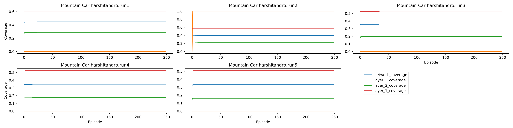
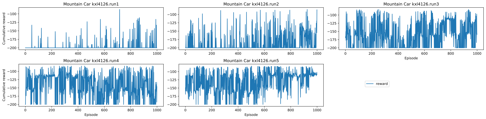
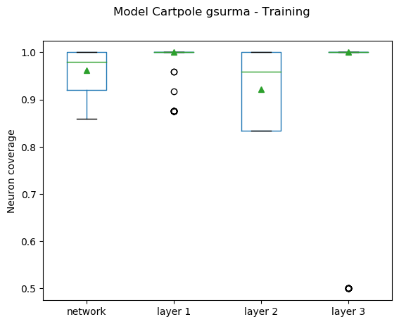
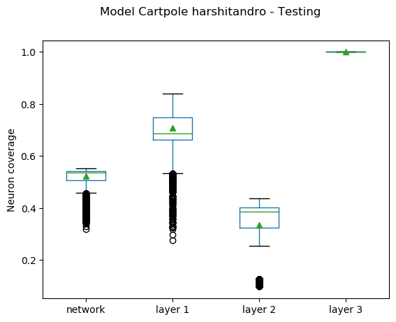
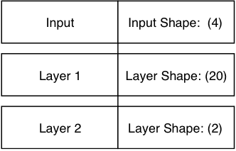
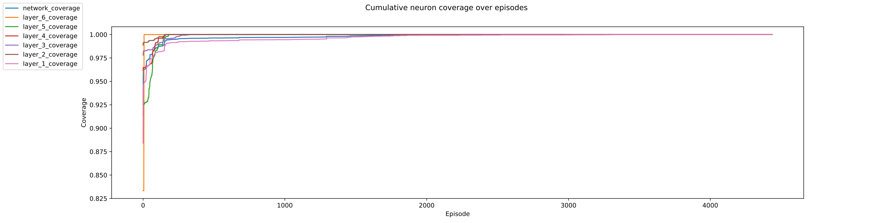

Recent increase in use of RL, and specifically DRL, in real-world scenarios is promoting the need for an approach to systematic software testing of DRL-based applications. Multiple approaches to testing DNN, an integral part of DRL, have been proposed, but their applicability to DRL has not been investigated. Specifically, neuron coverage in DNN is thought to be a valid test adequacy metric, as in DNN more extensive coverage allows the network to be trained for edge cases. In this study, we investigate whether neuron coverage is a suitable metric for DRL testing approaches. As DRL relies on the environment reward to infer the desired behavior, we evaluate whether neuron coverage could be considered an adequate metric, if it is correlated with the rewards obtained by the DRL system. To that effect, we investigate the relationship between multiple aspects of neuron coverage and the rewards in 19 different DRL systems, selected to cover the range of DNN architectures and reward models. We found no evidence of correlation between neuron coverage and higher rewards in DRL, suggesting that in DRL neuron coverage alone cannot be considered a suitable metric for test adequacy. 

<h1 id="mc-problem">The Mountain Car Problem</h1>

<h2 id="mc-Branavg-model">Branavg model</h2>

> The model is available [here](https://github.com/branavg/Deep-Q-learning).

    <figure class="image">
      
      <figcaption>Network architecture of branavg model</figcaption>
    </figure>

    <figure class="image">
      
      <figcaption>Distribution of cumulative coverage for branavg model during training phase on MC</figcaption>
    </figure>

    <figure class="image">
      
      <figcaption>Distribution of cumulative coverage for branavg model during testing phase on MC</figcaption>
    </figure>

    <figure class="image">
      
      <figcaption>CNC and CNCL over episodes for branavg model during training phase on MC</figcaption>
    </figure>

    <figure class="image">
      
      <figcaption>Cumulative reward over episodes for branavg model during training phase on MC</figcaption>
    </figure>

    <figure class="image">
      
      <figcaption>CNC and CNCL over episodes for branavg model during testing phase on MC</figcaption>
    </figure>

<h2 id="mc-Harshitandro-model">Harshitandro model</h2>

> The model is available [here](https://github.com/harshitandro/Deep-Q-Network).

    <figure class="image">
      
      <figcaption>Network architecture of harshitandro model</figcaption>
    </figure>

    <figure class="image">
      
      <figcaption>Distribution of cumulative coverage for harshitandro model during training phase on MC</figcaption>
    </figure>

    <figure class="image">
      
      <figcaption>Distribution of cumulative coverage for harshitandro model during testing phase on MC</figcaption>
    </figure>

    <figure class="image">
      
      <figcaption>CNC and CNCL over episodes for harshitandro model during training phase on MC</figcaption>
    </figure>

    <figure class="image">
      
      <figcaption>Cumulative reward over episodes for harshitandro model during training phase on MC</figcaption>
    </figure>

    <figure class="image">
      
      <figcaption>CNC and CNCL over episodes for harshitandro model during testing phase on MC</figcaption>
    </figure>

<h2 id="mc-Kxl4126-model">Kxl4126 model</h2>

> The model is available [here](https://github.com/kxl4126/MountainCarDQN).

    <figure class="image">
      
      <figcaption>Network architecture of kxl4126 model</figcaption>
    </figure>

    <figure class="image">
      
      <figcaption>Distribution of cumulative coverage for kxl4126 model during training phase on MC</figcaption>
    </figure>

    <figure class="image">
      
      <figcaption>Distribution of cumulative coverage for kxl4126 model during testing phase on MC</figcaption>
    </figure>

    <figure class="image">
      
      <figcaption>CNC and CNCL over episodes for kxl4126 model during training phase on MC</figcaption>
    </figure>

    <figure class="image">
      
      <figcaption>Cumulative reward over episodes for kxl4126 model during training phase on MC</figcaption>
    </figure>

    <figure class="image">
      
      <figcaption>CNC and CNCL over episodes for kxl4126 model during testing phase on MC</figcaption>
    </figure>

<h2 id="mc-MLnewlifer-model">MLnewlifer model</h2>

> The model is available [here](https://github.com/MLnewlifer/MountainCar-DQN).

    <figure class="image">
      
      <figcaption>Network architecture of MLnewlifer model</figcaption>
    </figure>

    <figure class="image">
      
      <figcaption>Distribution of cumulative coverage for MLnewlifer model during training phase on MC</figcaption>
    </figure>

    <figure class="image">
      
      <figcaption>Distribution of cumulative coverage for MLnewlifer model during testing phase on MC</figcaption>
    </figure>

    <figure class="image">
      
      <figcaption>CNC and CNCL over episodes for MLnewlifer model during training phase on MC</figcaption>
    </figure>

    <figure class="image">
      
      <figcaption>Cumulative reward over episodes for MLnewlifer model during training phase on MC</figcaption>
    </figure>

    <figure class="image">
      
      <figcaption>CNC and CNCL over episodes for MLnewlifer model during testing phase on MC</figcaption>
    </figure>

<h2 id="mc-PylSER-model">PylSER model</h2>

> The model is available [here](https://github.com/pylSER/Deep-Reinforcement-learning-Mountain-Car).

    <figure class="image">
      
      <figcaption>Network architecture of pylSER model</figcaption>
    </figure>

    <figure class="image">
      
      <figcaption>Distribution of cumulative coverage for pylSER model during training phase on MC</figcaption>
    </figure>

    <figure class="image">
      
      <figcaption>Distribution of cumulative coverage for pylSER model during testing phase on MC</figcaption>
    </figure>

    <figure class="image">
      
      <figcaption>CNC and CNCL over episodes for pylSER model during training phase on MC</figcaption>
    </figure>

    <figure class="image">
      
      <figcaption>Cumulative reward over episodes for pylSER model during training phase on MC</figcaption>
    </figure>

    <figure class="image">
      
      <figcaption>CNC and CNCL over episodes for pylSER model during testing phase on MC</figcaption>
    </figure>

<h1 id="mcc-problem">The Mountain Car Problem with continuous reward</h1>

<h2 id="mcc-Branavg-model">Branavg model</h2>

    <figure class="image">
      
      <figcaption>Distribution of cumulative coverage for branavg model during training phase on MC with continuous reward</figcaption>
    </figure>

    <figure class="image">
      
      <figcaption>Distribution of cumulative coverage for branavg model during testing phase on MC with continuous reward</figcaption>
    </figure>

    <figure class="image">
      
      <figcaption>CNC and CNCL over episodes for branavg model during training phase on MC with continuous reward</figcaption>
    </figure>

    <figure class="image">
      
      <figcaption>Cumulative reward over episodes for branavg model during training phase on MC with continuous reward</figcaption>
    </figure>

    <figure class="image">
      
      <figcaption>CNC and CNCL over episodes for branavg model during testing phase on MC with continuous reward</figcaption>
    </figure>

<h2 id="mcc-Harshitandro-model">Harshitandro model</h2>

    <figure class="image">
      
      <figcaption>Distribution of cumulative coverage for harshitandro model during training phase on MC with continuous reward</figcaption>
    </figure>

    <figure class="image">
      
      <figcaption>Distribution of cumulative coverage for harshitandro model during testing phase on MC with continuous reward</figcaption>
    </figure>

    <figure class="image">
      
      <figcaption>CNC and CNCL over episodes for harshitandro model during training phase on MC with continuous reward</figcaption>
    </figure>

    <figure class="image">
      
      <figcaption>Cumulative reward over episodes for harshitandro model during training phase on MC with continuous reward</figcaption>
    </figure>

    <figure class="image">
      
      <figcaption>CNC and CNCL over episodes for harshitandro model during testing phase on MC with continuous reward</figcaption>
    </figure>

<h2 id="mcc-Kxl4126-model">Kxl4126 model</h2>

    <figure class="image">
      
      <figcaption>Distribution of cumulative coverage for kxl4126 model during training phase on MC with continuous reward</figcaption>
    </figure>

    <figure class="image">
      
      <figcaption>Distribution of cumulative coverage for kxl4126 model during testing phase on MC with continuous reward</figcaption>
    </figure>

    <figure class="image">
      
      <figcaption>CNC and CNCL over episodes for kxl4126 model during training phase on MC with continuous reward</figcaption>
    </figure>

    <figure class="image">
      
      <figcaption>Cumulative reward over episodes for kxl4126 model during training phase on MC with continuous reward</figcaption>
    </figure>

    <figure class="image">
      
      <figcaption>CNC and CNCL over episodes for kxl4126 model during testing phase on MC with continuous reward</figcaption>
    </figure>

<h2 id="mcc-MLnewlifer-model">MLnewlifer model</h2>

    <figure class="image">
      
      <figcaption>Distribution of cumulative coverage for MLnewlifer model during training phase on MC with continuous reward</figcaption>
    </figure>

    <figure class="image">
      
      <figcaption>Distribution of cumulative coverage for MLnewlifer model during testing phase on MC with continuous reward</figcaption>
    </figure>

    <figure class="image">
      
      <figcaption>CNC and CNCL over episodes for MLnewlifer model during training phase on MC with continuous reward</figcaption>
    </figure>

    <figure class="image">
      
      <figcaption>Cumulative reward over episodes for MLnewlifer model during training phase on MC with continuous reward</figcaption>
    </figure>

    <figure class="image">
      
      <figcaption>CNC and CNCL over episodes for MLnewlifer model during testing phase on MC with continuous reward</figcaption>
    </figure>

<h2 id="mcc-PylSER-model">PylSER model</h2>

    <figure class="image">
      
      <figcaption>Distribution of cumulative coverage for pylSER model during training phase on MC with continuous reward</figcaption>
    </figure>

    <figure class="image">
      
      <figcaption>Distribution of cumulative coverage for pylSER model during testing phase on MC with continuous reward</figcaption>
    </figure>

    <figure class="image">
      
      <figcaption>CNC and CNCL over episodes for pylSER model during training phase on MC with continuous reward</figcaption>
    </figure>

    <figure class="image">
      
      <figcaption>Cumulative reward over episodes for pylSER model during training phase on MC with continuous reward</figcaption>
    </figure>

    <figure class="image">
      
      <figcaption>CNC and CNCL over episodes for pylSER model during testing phase on MC with continuous reward</figcaption>
    </figure>

<h1 id="cp-problem">The Cartpole Problem</h1>

<h2 id="cp-CFOnHeart-model">CFOnHeart model</h2>

> The model is available [here](https://github.com/CFOnHeart/ReforceLearning).

    <figure class="image">
      
      <figcaption>Network architecture of CFOnHeart model</figcaption>
    </figure>

    <figure class="image">
      
      <figcaption>Distribution of cumulative coverage for CFOnHeart model during training phase on CP</figcaption>
    </figure>

    <figure class="image">
      
      <figcaption>Distribution of cumulative coverage for CFOnHeart model during testing phase on CP</figcaption>
    </figure>

    <figure class="image">
      
      <figcaption>CNC and CNCL over episodes for CFOnHeart model during training phase on CP</figcaption>
    </figure>

    <figure class="image">
      
      <figcaption>Cumulative reward over episodes for CFOnHeart model during training phase on CP</figcaption>
    </figure>

    <figure class="image">
      
      <figcaption>CNC and CNCL over episodes for CFOnHeart model during testing phase on CP</figcaption>
    </figure>

<h2 id="cp-Gsurma-model">Gsurma model</h2>

> The model is available [here](https://github.com/gsurma/cartpole).

    <figure class="image">
      
      <figcaption>Network architecture of gsurma model</figcaption>
    </figure>

    <figure class="image">
      
      <figcaption>Distribution of cumulative coverage for gsurma model during training phase on CP</figcaption>
    </figure>

    <figure class="image">
      
      <figcaption>Distribution of cumulative coverage for gsurma model during testing phase on CP</figcaption>
    </figure>

    <figure class="image">
      
      <figcaption>CNC and CNCL over episodes for gsurma model during training phase on CP</figcaption>
    </figure>

    <figure class="image">
      
      <figcaption>Cumulative reward over episodes for gsurma model during training phase on CP</figcaption>
    </figure>

    <figure class="image">
      
      <figcaption>CNC and CNCL over episodes for gsurma model during testing phase on CP</figcaption>
    </figure>

<h2 id="cp-Harshitandro-model">Harshitandro model</h2>

> The model is available [here](https://github.com/harshitandro/Deep-Q-Network).

    <figure class="image">
      
      <figcaption>Network architecture of harshitandro model</figcaption>
    </figure>

    <figure class="image">
      
      <figcaption>Distribution of cumulative coverage for harshitandro model during training phase on CP</figcaption>
    </figure>

    <figure class="image">
      
      <figcaption>Distribution of cumulative coverage for harshitandro model during testing phase on CP</figcaption>
    </figure>

    <figure class="image">
      
      <figcaption>CNC and CNCL over episodes for harshitandro model during training phase on CP</figcaption>
    </figure>

    <figure class="image">
      
      <figcaption>Cumulative reward over episodes for harshitandro model during training phase on CP</figcaption>
    </figure>

    <figure class="image">
      
      <figcaption>CNC and CNCL over episodes for harshitandro model during testing phase on CP</figcaption>
    </figure>

<h2 id="cp-Junliangliu-model">Junliangliu model</h2>

> The model is available [here](https://github.com/junliangliu/DQN).

    <figure class="image">
      
      <figcaption>Network architecture of junliangliu model</figcaption>
    </figure>

    <figure class="image">
      
      <figcaption>Distribution of cumulative coverage for junliangliu model during training phase on CP</figcaption>
    </figure>

    <figure class="image">
      
      <figcaption>Distribution of cumulative coverage for junliangliu model during testing phase on CP</figcaption>
    </figure>

    <figure class="image">
      
      <figcaption>CNC and CNCL over episodes for junliangliu model during training phase on CP</figcaption>
    </figure>

    <figure class="image">
      
      <figcaption>Cumulative reward over episodes for junliangliu model during training phase on CP</figcaption>
    </figure>

    <figure class="image">
      
      <figcaption>CNC and CNCL over episodes for junliangliu model during testing phase on CP</figcaption>
    </figure>

<h2 id="cp-Z0m6ie-model">Z0m6ie model</h2>

> The model is available [here](https://github.com/Z0m6ie/CartPole_DDQN).

    <figure class="image">
      
      <figcaption>Network architecture of Z0m6ie model</figcaption>
    </figure>

    <figure class="image">
      
      <figcaption>Distribution of cumulative coverage for Z0m6ie model during training phase on CP</figcaption>
    </figure>

    <figure class="image">
      
      <figcaption>Distribution of cumulative coverage for Z0m6ie model during testing phase on CP</figcaption>
    </figure>

    <figure class="image">
      
      <figcaption>CNC and CNCL over episodes for Z0m6ie model during training phase on CP</figcaption>
    </figure>

    <figure class="image">
      
      <figcaption>Cumulative reward over episodes for Z0m6ie model during training phase on CP</figcaption>
    </figure>

    <figure class="image">
      
      <figcaption>CNC and CNCL over episodes for Z0m6ie model during testing phase on CP</figcaption>
    </figure>

<h1 id="smb-problem">The Super Mario Bros. Game</h1>

<h2 id="smb-1-model">SMB1 model</h2>

    <figure class="image">
      
      <figcaption>Network architecture of smb1 model</figcaption>
    </figure>

    <figure class="image">
      
      <figcaption>Distribution of cumulative coverage for smb1 model during training phase on SMB</figcaption>
    </figure>

    <figure class="image">
      
      <figcaption>Distribution of cumulative coverage for smb1 model during testing phase on SMB</figcaption>
    </figure>

    <figure class="image">
      
      <figcaption>CNC and CNCL over episodes for smb1 model during training phase on SMB</figcaption>
    </figure>

    <figure class="image">
      
      <figcaption>Cumulative reward over episodes for smb1 model during training phase on SMB</figcaption>
    </figure>

    <figure class="image">
      
      <figcaption>CNC and CNCL over episodes for smb1 model during testing phase on SMB</figcaption>
    </figure>

<h2 id="smb-2-model">SMB2 model</h2>

    <figure class="image">
      
      <figcaption>Network architecture of smb2 model</figcaption>
    </figure>

    <figure class="image">
      
      <figcaption>Distribution of cumulative coverage for smb2 model during training phase on SMB</figcaption>
    </figure>

    <figure class="image">
      
      <figcaption>Distribution of cumulative coverage for smb2 model during testing phase on SMB</figcaption>
    </figure>

    <figure class="image">
      
      <figcaption>CNC and CNCL over episodes for smb2 model during training phase on SMB</figcaption>
    </figure>

    <figure class="image">
      
      <figcaption>Cumulative reward over episodes for smb2 model during training phase on SMB</figcaption>
    </figure>

    <figure class="image">
      
      <figcaption>CNC and CNCL over episodes for smb2 model during testing phase on SMB</figcaption>
    </figure>

<h2 id="smb-3-model">SMB3 model</h2>

    <figure class="image">
      
      <figcaption>Network architecture of smb3 model</figcaption>
    </figure>

    <figure class="image">
      
      <figcaption>Distribution of cumulative coverage for smb3 model during training phase on SMB</figcaption>
    </figure>

    <figure class="image">
      
      <figcaption>Distribution of cumulative coverage for smb3 model during testing phase on SMB</figcaption>
    </figure>

    <figure class="image">
      
      <figcaption>CNC and CNCL over episodes for smb3 model during training phase on SMB</figcaption>
    </figure>

    <figure class="image">
      
      <figcaption>Cumulative reward over episodes for smb3 model during training phase on SMB</figcaption>
    </figure>

    <figure class="image">
      
      <figcaption>CNC and CNCL over episodes for smb3 model during testing phase on SMB</figcaption>
    </figure>

<h2 id="smb-4-model">SMB4 model</h2>

    <figure class="image">
      
      <figcaption>Network architecture of smb4 model</figcaption>
    </figure>

    <figure class="image">
      
      <figcaption>Distribution of cumulative coverage for smb4 model during training phase on SMB</figcaption>
    </figure>

    <figure class="image">
      
      <figcaption>Distribution of cumulative coverage for smb4 model during testing phase on SMB</figcaption>
    </figure>

    <figure class="image">
      
      <figcaption>CNC and CNCL over episodes for smb4 model during training phase on SMB</figcaption>
    </figure>

    <figure class="image">
      
      <figcaption>Cumulative reward over episodes for smb4 model during training phase on SMB</figcaption>
    </figure>

    <figure class="image">
      
      <figcaption>CNC and CNCL over episodes for smb4 model during testing phase on SMB</figcaption>
    </figure>

---
Hosted on GitHub Pages - Theme by [orderedlist](https://github.com/orderedlist)
